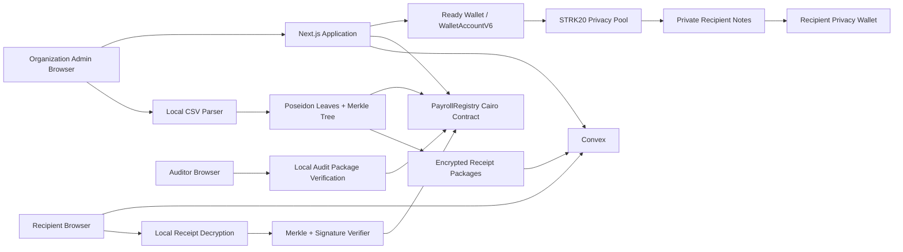

# ShadowLedger — Complete Implementation Plan

> **Project:** ShadowLedger  
> **Hackathon:** STRK20 Private Sprint 2026  
> **Primary track:** Payments  
> **Inspired by:** RFP-11 — Private payroll and treasury disbursement at company scale  
> **Build window:** August 14–31, 2026  
> **Submission deadline:** August 31, 2026 at 23:59 UTC  
> **Internal feature-freeze target:** August 29, 2026  
> **Plan version:** 1.0  
> **Verified against official sources:** August 14, 2026

---

## 1. Executive Summary

ShadowLedger is a privacy-preserving payroll and treasury-disbursement application on Starknet. It lets an organization pay employees, contractors, grant recipients, or contributors through the live STRK20 privacy pool while keeping every recipient address and individual payment amount private from the public.

The application deliberately separates two concerns:

1. **Public accountability:** a Cairo `PayrollRegistry` contract records the payroll run's aggregate amount, token, recipient count, Merkle root, and successful STRK20 transaction hash.
2. **Private distribution:** a STRK20 batch transaction creates encrypted notes for the recipients without exposing who received what.

The hackathon MVP will demonstrate one complete mainnet workflow:

1. The organization connects a privacy-enabled Starknet wallet.
2. It imports or enters a payroll for three to five pre-registered recipients.
3. The browser validates the payroll and constructs a salted Poseidon Merkle tree locally.
4. The organization publishes only the aggregate payroll commitment.
5. The organization executes a multi-recipient STRK20 private-transfer batch.
6. The registry run is finalized with the successful STRK20 transaction hash.
7. A recipient opens an encrypted claim package and verifies that their payment was included in the public commitment.
8. An auditor locally verifies the complete payroll book against the on-chain root and aggregate total.

The reliable MVP uses a separate registry transaction and STRK20 batch transaction. An optional atomic `PayrollAnchorHelper` anonymizer may be attempted only after the entire MVP works on mainnet and only after the STRK20 team confirms that a zero-value `privacy_invoke` is supported for this use case.

---

## 2. Hackathon Constraints That Drive the Plan

The official sprint requires:

- A public, open-source repository with a license.
- A working product on Starknet mainnet.
- Integration with the live STRK20 privacy pool.
- At least three successful mainnet transaction hashes that touched the STRK20 pool.
- A public live demo.
- A three-minute demo video.
- A root-level `strk20.json` containing the evidence.
- Final repository state ready before August 31, 2026 at 23:59 UTC.

The judging weights are:

| Criterion | Weight | ShadowLedger response |
|---|---:|---|
| STRK20 integration depth | 30% | Wallet API, shielded balance, private transfers, multi-action payroll batch, capability detection, optional helper contract |
| Working mainnet product | 30% | Real mainnet shield and at least two private payroll runs with verifiable transaction hashes |
| Innovation | 25% | Private individual compensation plus public aggregate accountability and selective payroll receipts |
| Documentation and open-source quality | 15% | Reusable payroll-core package, Cairo tests, privacy specification, threat model, mainnet runbook, receipt specification |

### Eligibility evidence target

Do not stop at the minimum of three transactions. Target four pool interactions:

1. Mainnet shield transaction.
2. First three-recipient private payroll transaction.
3. Second private payroll transaction.
4. Optional private transfer or unshield transaction for additional evidence.

The ordinary `PayrollRegistry` contract calls do **not** count toward the required STRK20 pool transactions.

---

## 3. Product Definition

### 3.1 Product name

**ShadowLedger**

### 3.2 Tagline

**Private payments. Public accountability.**

### 3.3 One-line pitch

ShadowLedger lets organizations distribute payroll and treasury funds through STRK20 without exposing individual recipients or amounts, while publishing an auditable aggregate commitment and selectively disclosable payment receipts.

### 3.4 Target users

- Crypto-native companies paying employees.
- DAOs paying contributors.
- Grant programs paying recipients.
- Marketplaces paying contractors.
- Open-source foundations distributing contributor rewards.
- Small organizations making confidential treasury disbursements.

### 3.5 Core problem

Transparent on-chain payroll reveals:

- Employee and contractor wallet addresses.
- Individual salaries and payment differences.
- Payment frequency.
- Treasury relationships.
- Recipient balances and transaction behavior.
- High-value recipients who may become phishing or social-engineering targets.

ShadowLedger keeps the public accountability benefits of on-chain finance without publishing the private compensation details of every person involved.

---

## 4. Winning Product Thesis

The product should not attempt to become a complete global payroll company during an 18-day sprint. It should prove one difficult, valuable, and technically credible primitive:

> **A company can commit to an aggregate payroll run, distribute it privately to several people through STRK20, and let a recipient or auditor selectively verify the relevant information without publishing the entire payroll book.**

The strongest demo is not a feature-heavy dashboard. It is a side-by-side privacy proof:

```text
PUBLIC VIEW
-----------
Payroll run: August 2026
Token: STRK
Total: 100 STRK
Recipients: 3
Merkle root: 0x...
STRK20 transaction: 0x...
Individual recipients: hidden
Individual amounts: hidden

RECIPIENT VIEW
--------------
My payment: 37 STRK
Run: August 2026
Merkle inclusion: valid
Payer attestation: valid
Other recipients: hidden
Other amounts: hidden
```

---

## 5. Scope

### 5.1 P0 — Required hackathon MVP

These items must be complete before any stretch feature begins.

- Public GitHub repository and hackathon registration PR.
- MIT or Apache-2.0 license.
- Next.js application deployed publicly.
- Ready-wallet connection on Starknet mainnet.
- Wallet API capability detection.
- Shielded STRK balance display.
- Recipient onboarding instructions and registration precondition.
- Manual payroll-entry form.
- CSV import parsed entirely in the browser.
- Validation for recipient, amount, duplicates, token, and total.
- Salted Poseidon payroll leaves.
- Merkle root, inclusion proofs, and canonical manifest generation.
- Cairo `PayrollRegistry` contract.
- Contract unit tests.
- Mainnet contract deployment.
- Three-to-five-recipient STRK20 private payroll batch.
- Simulation/dry-run before submission.
- Transaction state machine and retry-safe UX.
- Registry finalization with the successful STRK20 transaction hash.
- Encrypted recipient claim packages.
- Recipient-side Merkle verification.
- Payer-signed receipt.
- Local auditor verification page.
- At least three successful STRK20 pool transactions in `strk20.json`.
- Complete README, architecture documentation, privacy model, threat model, and mainnet runbook.
- Three-minute demo video.

### 5.2 P1 — Strong differentiation

Build only after P0 works end to end on mainnet.

- Organization dashboard with several payroll runs.
- Encrypted audit-package export.
- Recipient countersignature on a receipt.
- Reusable `@shadowledger/payroll-core` workspace package.
- Verification widget that another project can embed.
- Public verification page requiring no wallet.
- Privacy-safe transaction progress and error diagnostics.
- Second supported token, only if verified with STRK20.
- Polished before-versus-after privacy visualization.
- Full test fixture that reproduces the demo payroll.
- Published npm package if time permits.
- One external team integrating the receipt verifier, if naturally possible.

### 5.3 P2 — Stretch features

These are explicitly non-critical.

- Atomic commitment anchoring through a custom `privacy_invoke` helper.
- Recipient registration sponsored through a paymaster.
- Recurring payroll schedules.
- Session key scoped to one payroll run and maximum budget.
- Private vesting.
- Multisig organization administration.
- Threshold-encrypted auditor package.
- Zero-knowledge statement such as “income exceeded X” without revealing the exact amount.
- Full viewing-key-derived income statement, if the currently available wallet or SDK interface safely supports it.
- Payroll API for external companies.
- Cross-chain funding.

### 5.4 Non-goals for the sprint

- Fiat banking integration.
- Tax filing for multiple countries.
- KYC provider integration.
- Employee management or attendance.
- Automated currency conversion.
- Cards.
- Lending or salary advances.
- Custody of user funds.
- Self-hosted prover infrastructure.
- Private sub-accounts as a required dependency.
- AI features in the critical path.

---

## 6. Honest Privacy Claims

### 6.1 What ShadowLedger hides

Inside the STRK20 pool:

- Sender-to-recipient relationship.
- Recipient wallet addresses in the payroll transfer.
- Individual payroll amounts.
- Token type within the private transfer.
- Which encrypted notes were spent.
- Recipient balances held as private notes.

### 6.2 What remains public

- A wallet registered with the pool.
- Shield/deposit address, token, amount, and time.
- Withdrawal address, token, amount, and time.
- The fact that a STRK20 pool transaction occurred.
- Payroll aggregate amount, token, recipient count, period hash, and Merkle root.
- `PayrollRegistry` transaction sender unless the optional anonymous anchor is implemented.
- Timing of payroll commitment, private transaction, and finalization.
- Any data a recipient voluntarily reveals in a receipt.

### 6.3 MVP receipt limitation

The MVP receipt provides:

- Proof that the recipient's disclosed payroll item belongs to the public payroll commitment.
- A signature from the payer attesting that the committed item corresponds to the listed STRK20 transaction.
- A successful STRK20 transaction reference.
- Optional recipient countersignature.

It does **not** independently reveal the hidden internals of the STRK20 transaction to a public verifier. Do not claim that a public verifier can cryptographically inspect a private note and prove its exact amount without a viewing-key-compatible disclosure mechanism.

A wallet- or SDK-derived note disclosure is a P2 feature and must be described separately if implemented.

---

## 7. User Roles

### 7.1 Organization administrator

Can:

- Connect the treasury wallet.
- View shielded balance.
- Create a payroll run.
- Import recipients.
- Publish a commitment.
- Execute the private batch.
- Finalize the run.
- Export recipient claim packages.
- Export the complete audit package.

Cannot:

- Change a run after the Merkle root is published.
- Mark an unsuccessful private transaction as successful without making a separate public attestation that remains auditable.

### 7.2 Recipient

Can:

- Register a privacy-enabled wallet.
- Receive a private note.
- Open an encrypted claim package.
- Verify their Merkle inclusion proof.
- Verify the payer's signature.
- Download or share a selective receipt.
- Optionally countersign the receipt.

Cannot:

- See any other recipient or amount.
- Derive the complete payroll book from the public root.

### 7.3 Auditor or verifier

Can:

- Inspect public aggregate run information.
- Verify a recipient's disclosed receipt.
- Upload a complete audit package locally and reconstruct the Merkle root.
- Confirm total, recipient count, token, and manifest hash.

Cannot:

- Decrypt recipient details without a voluntarily supplied receipt or audit package.
- Spend anyone's funds.

### 7.4 Public observer

Can see aggregate accountability data and successful transaction references, but not the individual payroll breakdown.

---

## 8. End-to-End Architecture



### 8.1 Critical trust boundaries

| Boundary | Rule |
|---|---|
| Browser ↔ wallet | Viewing keys remain in the wallet when using the Wallet API |
| Browser ↔ Convex | Only public metadata or ciphertext may leave the browser |
| Browser ↔ registry | Only aggregate data and commitments are submitted |
| Admin ↔ recipient | Receipt package is encrypted client-side before upload |
| Auditor page | Full payroll package is processed locally and never uploaded |
| Logs | Never log addresses, amounts, salts, receipt keys, CSV rows, or wallet signatures |

---

## 9. Recommended Technical Stack

### 9.1 Frontend

- Next.js 16, based on the official/community STRK20 starter kit.
- React 19.
- TypeScript with `strict: true`.
- Tailwind CSS.
- shadcn/ui for fast, accessible components.
- Zustand only for short-lived wallet and transaction state.
- React Hook Form plus Zod for forms.
- Papa Parse for local CSV parsing.
- Web Crypto API for AES-GCM receipt encryption.
- Starknet Poseidon utilities for commitment hashing.
- A small audited Merkle implementation or a simple internal implementation with extensive fixtures.

### 9.2 Starknet and STRK20

- `starknet@^10.4.0`, pinned through the lockfile.
- `WalletAccountV6`.
- `STRK20_ACTION`.
- `strk20Balances`.
- `strk20PrepareInvoke`.
- `strk20InvokeTransaction`.
- `@starknet-io/get-starknet` v6-compatible packages.
- `@starknet-io/types-js` compatible with Wallet API 0.10.3.
- Ready wallet as the explicitly supported MVP wallet.
- Mainnet pool address supplied through environment variables.

### 9.3 Cairo

- Cairo and Scarb versions copied from a currently compatible STRK20 reference package.
- Starknet Foundry for tests.
- OpenZeppelin Cairo components only where version compatibility is verified.
- Non-upgradeable registry for the sprint.

### 9.4 Backend and storage

- Convex for:
  - Organization profiles.
  - Public run metadata cache.
  - Encrypted recipient blobs.
  - Encrypted audit blobs.
  - Transaction-status cache.
- No plaintext payroll data in Convex.
- No background AI jobs are needed.

### 9.5 Hosting and CI

- Vercel for the web application.
- GitHub Actions for lint, typecheck, unit tests, Cairo tests, and production build.
- GitHub Releases or repository tags for demo milestones.

---

## 10. Repository Structure

```text
shadowledger/
├── apps/
│   └── web/
│       ├── app/
│       │   ├── page.tsx
│       │   ├── app/
│       │   ├── org/
│       │   │   ├── dashboard/
│       │   │   └── runs/
│       │   │       ├── new/
│       │   │       └── [runId]/
│       │   ├── recipient/
│       │   │   └── activate/
│       │   ├── claim/
│       │   ├── verify/
│       │   ├── auditor/
│       │   ├── privacy/
│       │   └── docs/
│       ├── components/
│       │   ├── wallet/
│       │   ├── payroll/
│       │   ├── receipts/
│       │   └── ui/
│       ├── lib/
│       │   ├── strk20/
│       │   ├── registry/
│       │   ├── encryption/
│       │   ├── convex/
│       │   └── telemetry/
│       └── tests/
├── contracts/
│   ├── src/
│   │   ├── payroll_registry.cairo
│   │   └── payroll_anchor_helper.cairo
│   ├── tests/
│   │   └── test_payroll_registry.cairo
│   ├── Scarb.toml
│   └── snfoundry.toml
├── packages/
│   ├── payroll-core/
│   │   ├── src/
│   │   │   ├── canonical.ts
│   │   │   ├── validation.ts
│   │   │   ├── commitments.ts
│   │   │   ├── merkle.ts
│   │   │   ├── receipts.ts
│   │   │   └── encryption.ts
│   │   └── tests/
│   └── registry-client/
├── convex/
│   ├── schema.ts
│   ├── organizations.ts
│   ├── payrollRuns.ts
│   ├── encryptedBlobs.ts
│   └── http.ts
├── scripts/
│   ├── deploy-registry.ts
│   ├── verify-mainnet-tx.ts
│   ├── create-demo-fixture.ts
│   └── validate-strk20-json.ts
├── docs/
│   ├── ARCHITECTURE.md
│   ├── PRIVACY_MODEL.md
│   ├── THREAT_MODEL.md
│   ├── RECEIPT_SPEC.md
│   ├── MAINNET_RUNBOOK.md
│   ├── DEMO_SCRIPT.md
│   ├── SECURITY_CHECKLIST.md
│   └── INTEGRATION_GUIDE.md
├── public/
│   └── demo/
├── .github/
│   └── workflows/
│       └── ci.yml
├── .env.example
├── CONTRIBUTING.md
├── LICENSE
├── README.md
├── SECURITY.md
├── package.json
├── pnpm-workspace.yaml
├── pnpm-lock.yaml
└── strk20.json
```

Do not implement `payroll_anchor_helper.cairo` until P0 is working. Keep the placeholder file or issue, but do not deploy experimental logic as the primary path.

---

## 11. Environment Variables

```dotenv
# Public Starknet configuration
NEXT_PUBLIC_STARKNET_NETWORK=mainnet
NEXT_PUBLIC_STARKNET_CHAIN_ID=SN_MAIN
NEXT_PUBLIC_STARKNET_RPC_URL=https://rpc.starknet.lava.build
NEXT_PUBLIC_STRK20_POOL_ADDRESS=0x040337b1af3c663e86e333bab5a4b28da8d4652a15a69beee2b677776ffe812a
NEXT_PUBLIC_PAYROLL_REGISTRY_ADDRESS=

# Supported token
NEXT_PUBLIC_PAYROLL_TOKEN_ADDRESS=
NEXT_PUBLIC_PAYROLL_TOKEN_SYMBOL=STRK
NEXT_PUBLIC_PAYROLL_TOKEN_DECIMALS=18

# Convex
NEXT_PUBLIC_CONVEX_URL=
CONVEX_DEPLOYMENT=

# Server-side privacy-safe hashing
BLOB_LOOKUP_HMAC_SECRET=

# Optional
NEXT_PUBLIC_APP_URL=https://shadowledger.example
```

### Environment rules

- Never put wallet private keys or viewing keys in `.env`.
- Never hard-code the pool or token address in components.
- Verify the mainnet pool address against the official Day 0 guide immediately before deployment.
- The Wallet API route should let the wallet manage discovery and proving endpoints.
- Maintain separate `.env.local` and Vercel environments.
- Commit only `.env.example`.

---

## 12. Payroll Data Model

### 12.1 Canonical payroll entry

```ts
export interface PayrollEntryV1 {
  index: number;
  recipient: `0x${string}`;
  token: `0x${string}`;
  amount: bigint;        // smallest token unit
  periodHash: bigint;
  memoHash: bigint;      // optional; hash only
  salt: bigint;          // random felt, never public by default
}
```

### 12.2 Canonical run

```ts
export interface PayrollRunV1 {
  schema: "shadowledger/payroll-run/v1";
  network: "SN_MAIN";
  runId: bigint;
  organization: `0x${string}`;
  token: `0x${string}`;
  aggregateAmount: bigint;
  recipientCount: number;
  periodHash: bigint;
  merkleRoot: bigint;
  manifestHash: bigint;
  createdAt: string;
}
```

### 12.3 Receipt

```ts
export interface PayrollReceiptV1 {
  schema: "shadowledger/payroll-receipt/v1";
  run: PayrollRunV1;
  entry: PayrollEntryV1;
  merkleProof: {
    siblings: bigint[];
    directions: Array<"left" | "right">;
  };
  strk20TransactionHash: `0x${string}`;
  registryCreateTransactionHash: `0x${string}`;
  registryFinalizeTransactionHash: `0x${string}`;
  payerSignature: {
    signer: `0x${string}`;
    signature: string[];
    signedHash: bigint;
  };
  recipientSignature?: {
    signer: `0x${string}`;
    signature: string[];
    signedHash: bigint;
  };
}
```

---

## 13. Commitment and Merkle Specification

### 13.1 Domain separation

Use fixed domain tags so the hashes cannot be confused with other structures:

```text
SHADOWLEDGER_RUN_V1
SHADOWLEDGER_LEAF_V1
SHADOWLEDGER_NODE_V1
SHADOWLEDGER_MANIFEST_V1
SHADOWLEDGER_RECEIPT_V1
```

Convert each tag to a felt deterministically and document the exact conversion in `RECEIPT_SPEC.md`.

### 13.2 Run ID

```text
run_id = Poseidon(
  RUN_DOMAIN,
  organization_address,
  period_hash,
  organization_run_nonce
)
```

### 13.3 Leaf

```text
leaf = Poseidon(
  LEAF_DOMAIN,
  run_id,
  entry_index,
  recipient_address,
  token_address,
  amount_u128,
  period_hash,
  memo_hash,
  random_salt
)
```

### 13.4 Merkle node

Use positional hashing rather than sorted-pair hashing:

```text
parent = Poseidon(NODE_DOMAIN, left_child, right_child)
```

The proof includes a left/right direction for every sibling.

### 13.5 Padding

- Sort entries only by explicit `index`, never by recipient.
- Pad the final level to the next power of two.
- Use a documented `EMPTY_LEAF_V1` value for padding.
- Reject duplicate indices.
- Reject duplicate recipient addresses in the MVP unless the UI explicitly consolidates them.
- Store the exact canonical ordering in the audit package.

### 13.6 Manifest hash

The manifest contains no salts or recipient rows:

```json
{
  "schema": "shadowledger/payroll-manifest/v1",
  "network": "SN_MAIN",
  "runId": "0x...",
  "token": "0x...",
  "tokenDecimals": 18,
  "aggregateAmount": "100000000000000000000",
  "recipientCount": 3,
  "periodHash": "0x...",
  "merkleRoot": "0x...",
  "hashAlgorithm": "poseidon",
  "leafVersion": 1,
  "createdAt": "2026-08-24T12:00:00.000Z"
}
```

Hash its canonical JSON representation. Use a deterministic key order and decimal string representation for big integers.

### 13.7 Random salts

- Generate with `crypto.getRandomValues`.
- Use at least 248 random bits and reduce safely into a valid felt.
- Never derive salts from recipient addresses or amounts.
- Never reuse a salt.
- Keep salts only in encrypted recipient and auditor packages.
- Clear plaintext salts from application state after packages are generated.

---

## 14. Cairo `PayrollRegistry` Contract

### 14.1 Purpose

The registry stores only the public accountability layer. It never stores recipient addresses, individual amounts, salts, CSV content, or encryption keys.

### 14.2 Storage structure

```cairo
#[derive(Drop, Serde, starknet::Store)]
pub struct PayrollRun {
    pub owner: ContractAddress,
    pub token: ContractAddress,
    pub aggregate_amount: u128,
    pub recipient_count: u32,
    pub period_hash: felt252,
    pub merkle_root: felt252,
    pub manifest_hash: felt252,
    pub strk20_tx_hash: felt252,
    pub created_at: u64,
    pub finalized_at: u64,
    pub status: u8,
}
```

Storage:

```text
runs: Map<felt252, PayrollRun>
owner_nonces: Map<ContractAddress, u64>
```

Statuses:

```text
0 = Missing
1 = Created
2 = Finalized
3 = Cancelled
```

### 14.3 Contract interface

```cairo
#[starknet::interface]
pub trait IPayrollRegistry<TContractState> {
    fn create_run(
        ref self: TContractState,
        run_id: felt252,
        token: ContractAddress,
        aggregate_amount: u128,
        recipient_count: u32,
        period_hash: felt252,
        merkle_root: felt252,
        manifest_hash: felt252,
    );

    fn finalize_run(
        ref self: TContractState,
        run_id: felt252,
        strk20_tx_hash: felt252,
    );

    fn cancel_run(
        ref self: TContractState,
        run_id: felt252,
    );

    fn get_run(
        self: @TContractState,
        run_id: felt252,
    ) -> PayrollRun;

    fn get_owner_nonce(
        self: @TContractState,
        owner: ContractAddress,
    ) -> u64;
}
```

### 14.4 Events

```cairo
PayrollRunCreated {
  run_id,
  owner,
  token,
  aggregate_amount,
  recipient_count,
  period_hash,
  merkle_root,
  manifest_hash
}

PayrollRunFinalized {
  run_id,
  owner,
  strk20_tx_hash,
  finalized_at
}

PayrollRunCancelled {
  run_id,
  owner,
  cancelled_at
}
```

### 14.5 Invariants

- `run_id` must be unused.
- Caller becomes the immutable run owner.
- `token` cannot be zero.
- `aggregate_amount` must be greater than zero.
- `recipient_count` must be between 1 and `MAX_RECIPIENTS`.
- `merkle_root` and `manifest_hash` cannot be zero.
- Only the run owner can finalize or cancel.
- Only a `Created` run can be finalized.
- A finalized run cannot be changed or cancelled.
- `strk20_tx_hash` cannot be zero.
- No upgradeability in the sprint version.
- No admin function capable of rewriting a run.

### 14.6 Contract tests

Implement at least:

1. `test_create_run_success`.
2. `test_duplicate_run_reverts`.
3. `test_zero_token_reverts`.
4. `test_zero_amount_reverts`.
5. `test_zero_count_reverts`.
6. `test_count_above_max_reverts`.
7. `test_zero_root_reverts`.
8. `test_only_owner_can_finalize`.
9. `test_finalize_success`.
10. `test_finalize_twice_reverts`.
11. `test_cancel_success`.
12. `test_cancel_finalized_reverts`.
13. `test_finalize_cancelled_reverts`.
14. `test_events_contain_no_recipient_data`.
15. Fuzz tests for amount/count boundaries where supported.

---

## 15. STRK20 Integration Design

### 15.1 Integration route

Use the Starknet Wallet API through `WalletAccountV6` for the MVP because:

- The application never receives the user's viewing key.
- The wallet manages private state, note discovery, proving, signatures, and submission.
- It follows the recommended path for a normal private dapp.
- It reduces the risk of leaking payroll treasury key material.

Use the lower-level Privacy SDK only if a necessary Wallet API capability is missing and after discussing the exact limitation with the STRK20 team.

### 15.2 Capability detection

Before showing private actions:

1. Connect through get-starknet v6.
2. Confirm mainnet.
3. Confirm the wallet supports Wallet API version 0.10.3 or newer.
4. Confirm `WalletAccountV6` is available.
5. Confirm the connected wallet implements STRK20 actions.
6. Show an actionable unsupported-wallet message rather than failing during payroll.

Pseudocode:

```ts
const versions = await walletV6.supportedWalletApi(wallet);
const supported = versions.some(
  (version) => compareVersions(version, "0.10.3") >= 0,
);

if (!supported) {
  throw new UnsupportedPrivacyWalletError();
}
```

### 15.3 Shielded balance

```ts
const balances = await account.strk20Balances([tokenAddress]);
```

Display:

- Private balance.
- Required payroll amount.
- Difference.
- Token decimals.
- Status of the current note maturity precondition.

Never infer private balance from public events.

### 15.4 Recipient registration precondition

A recipient must be registered in the pool before receiving a private transfer.

For the hackathon demo:

- Prepare three recipient wallets.
- Register them on mainnet before the demo.
- Record only an internal checklist; do not publish their relationship to the payroll.
- Verify the transfer with a small test before the final demo.

Product onboarding page:

1. Connect recipient wallet.
2. Detect wallet capability.
3. Detect registration if the available API supports it.
4. Otherwise provide an “Activate private account” flow using the currently supported wallet action or official STRK20 application.
5. Show “Ready to receive private payroll” only after registration is confirmed.

Do not make paymaster-sponsored registration a P0 dependency.

### 15.5 Payroll batch action

Preferred action construction:

```ts
const actions: STRK20_ACTION[] = payroll.entries.map((entry) => ({
  type: "transfer",
  token: payroll.token,
  amount: toWalletAmount(entry.amount),
  recipient: entry.recipient,
}));
```

Then:

```ts
const prepared = await account.strk20PrepareInvoke(actions, true);
const { transaction_hash } =
  await account.strk20InvokeTransaction(actions);
```

Implementation requirements:

- Start with three recipients.
- Increase to five only after a successful test.
- Use exact smallest-unit amounts.
- Reject zero or negative amounts.
- Prevent duplicate recipient mistakes.
- Display the number of private actions before signing.
- Never put plaintext payroll rows in logs or error reports.

### 15.6 Batch fallback strategy

If a connected wallet or proof limit rejects the multi-recipient action array:

1. Reduce the batch to three recipients.
2. Retry simulation.
3. If still unsupported, execute one recipient per transaction for eligibility while keeping the batch implementation behind a feature flag.
4. If several sequential transfers use a change note, account for the roughly ten-block note-maturity requirement.
5. For the demo, pre-fund an exact payroll-total note so the batch creates no change note.
6. Keep each fallback transaction hash and clearly document the limitation.

A reliable three-recipient batch is better than an unstable attempt at fifty recipients.

### 15.7 Shielding strategy

A shield/deposit is public. To reduce timing correlation:

- Shield the demo treasury before the payroll demo.
- Wait at least the note-maturity window.
- Do not shield the exact amount and immediately execute payroll in front of the judges.
- For the final recording, begin with an already funded private treasury.
- Show the earlier shield transaction separately as evidence.

### 15.8 Simulation

Always run:

```ts
await account.strk20PrepareInvoke(actions, true);
```

before the real transaction.

Simulation failure should map to user-friendly categories:

- Unsupported wallet/API.
- Recipient not registered.
- Insufficient shielded balance.
- Immature input note.
- Invalid amount encoding.
- RPC unavailable.
- Proof generation failure.
- Contract/pool address mismatch.
- Unknown error with a redacted diagnostic export.

### 15.9 Transaction state machine

```text
DRAFT
  ↓
VALIDATED
  ↓
COMMITMENT_SUBMITTING
  ↓
COMMITMENT_CONFIRMED
  ↓
PRIVATE_SIMULATING
  ↓
PRIVATE_AWAITING_SIGNATURE
  ↓
PRIVATE_PROVING
  ↓
PRIVATE_SUBMITTED
  ↓
PRIVATE_CONFIRMED
  ↓
FINALIZING
  ↓
FINALIZED
```

Error states:

```text
COMMITMENT_FAILED
SIMULATION_FAILED
PRIVATE_REJECTED
PRIVATE_FAILED
FINALIZATION_FAILED
```

Rules:

- Persist non-sensitive state in IndexedDB so a refresh does not lose transaction hashes.
- Never silently resubmit a private transaction.
- Require explicit user action after an unknown submission result.
- Query the chain before retrying finalization.
- Make finalization idempotent at the UI layer.

---

## 16. Complete Organization Workflow

### Step 1 — Connect and verify

- Connect Ready wallet.
- Confirm `SN_MAIN`.
- Detect Wallet API support.
- Read public wallet address.
- Read private balance through the wallet.
- Load organization profile from Convex.

**Acceptance criteria:** The page clearly shows wallet, network, privacy capability, and shielded balance.

### Step 2 — Create run

Admin enters:

- Payroll period.
- Token.
- Entries manually or by CSV.
- Optional memo per entry.
- Optional organization display name.

**Acceptance criteria:** No row leaves the browser before encryption.

### Step 3 — Validate

Validate:

- Address format.
- Mainnet-compatible felt range.
- Amount is positive.
- Amount decimal precision does not exceed token decimals.
- Amount fits `u128`.
- No duplicate rows.
- Recipient count is inside MVP maximum.
- Sum is correct and fits `u128`.
- All recipient wallets satisfy the registration precondition.
- Private treasury balance covers the sum.

**Acceptance criteria:** The user cannot continue with an invalid or ambiguous payroll.

### Step 4 — Generate commitment

- Generate random salts.
- Hash memo text locally.
- Create leaves.
- Build Merkle tree.
- Generate each proof.
- Build canonical manifest.
- Compute manifest hash.
- Generate run ID.
- Display only public commitment values for confirmation.

**Acceptance criteria:** The same fixture always reproduces the same root when salts and order are unchanged.

### Step 5 — Generate encrypted packages before commitment

Generate:

- One recipient receipt payload per entry.
- One full auditor package.
- One local recovery bundle for the admin.

Encrypt before upload. Keep a local backup download in case the browser closes.

**Acceptance criteria:** Convex receives only ciphertext, IV, algorithm version, timestamps, and random blob identifiers.

### Step 6 — Publish commitment

Call:

```text
PayrollRegistry.create_run(...)
```

Wait for confirmation and save the transaction hash.

**Acceptance criteria:** Public registry page displays the run without recipient details.

### Step 7 — Dry-run the private batch

- Build all transfer actions.
- Run `strk20PrepareInvoke`.
- Surface warnings.
- Require explicit final confirmation.

**Acceptance criteria:** A failed simulation never moves the run into a paid state.

### Step 8 — Execute STRK20 payroll

- Request wallet signature.
- Show proof-generation state.
- Capture the returned transaction hash.
- Wait for chain success.
- Verify the transaction touched the configured pool.

**Acceptance criteria:** At least three recipient notes are created privately in one successful target flow.

### Step 9 — Finalize run

Call:

```text
PayrollRegistry.finalize_run(run_id, strk20_tx_hash)
```

Save finalization transaction hash.

**Acceptance criteria:** A finalized run cannot be changed.

### Step 10 — Publish recipient claim links

- Mark encrypted packages as claimable.
- Copy individual links.
- Never display all links on a public page.
- Allow admin to download an encrypted ZIP-like JSON bundle.

**Acceptance criteria:** A person without the fragment key cannot decrypt a package.

---

## 17. Recipient Claim and Verification Flow

### 17.1 Claim URL format

Use an opaque blob ID and an encryption key in the URL fragment:

```text
https://shadowledger.app/claim/<blob-id>#key=<base64url-aes-key>
```

The fragment is not sent to the server.

### 17.2 Claim process

1. Fetch ciphertext using the opaque blob ID.
2. Read the key from the URL fragment.
3. Decrypt locally with AES-256-GCM.
4. Validate receipt schema.
5. Connect the recipient wallet.
6. Verify the connected address equals the receipt entry.
7. Fetch the run from `PayrollRegistry`.
8. Confirm run status is finalized.
9. Confirm root, total, count, token, manifest hash, and transaction hash.
10. Recompute the leaf.
11. Verify the Merkle proof.
12. Verify the payer signature.
13. Show the receipt.
14. Optionally ask the recipient to countersign.
15. Download a portable JSON receipt.

### 17.3 Recipient UI status

```text
✓ Package decrypted locally
✓ Connected wallet matches recipient
✓ Payroll run finalized on Starknet
✓ Merkle inclusion valid
✓ Payer signature valid
✓ STRK20 transaction succeeded
```

Do not show “payment cryptographically proven inside the private note” unless a genuine note-disclosure mechanism is implemented and documented.

---

## 18. Payer Signature

After the private transaction succeeds, compute:

```text
receipt_attestation_hash = Poseidon(
  RECEIPT_DOMAIN,
  run_id,
  leaf,
  merkle_root,
  strk20_tx_hash
)
```

Ask the organization wallet to sign this hash or a typed-data structure containing the same values.

Requirements:

- Use Starknet typed data if supported.
- Include domain, chain ID, application name, and schema version.
- Verify the signature against the run owner.
- Never reuse a generic login signature.
- Store only the signature, not any secret.
- Document that the signature is the payer's attestation binding the committed line item to the private transaction reference.

---

## 19. Encrypted Receipt Storage

### 19.1 Encryption

- AES-256-GCM.
- Random 256-bit key per recipient.
- Random 96-bit IV.
- Additional authenticated data:
  - schema version,
  - blob ID,
  - run ID.
- Encrypt entirely in the browser.
- Encode ciphertext and IV as base64url.
- Put the encryption key only in the URL fragment and optional admin backup bundle.

### 19.2 Convex record

```ts
encryptedBlobs: defineTable({
  blobId: v.string(),
  kind: v.union(v.literal("recipient"), v.literal("auditor")),
  runId: v.string(),
  ciphertext: v.string(),
  iv: v.string(),
  aadVersion: v.number(),
  createdAt: v.number(),
  expiresAt: v.optional(v.number()),
  claimedAt: v.optional(v.number()),
})
  .index("by_blob_id", ["blobId"])
  .index("by_run_id", ["runId"]);
```

Do not store:

- Recipient address.
- Payment amount.
- Salt.
- Memo.
- Encryption key.
- CSV row.

### 19.3 Blob access

- Blob IDs must be cryptographically random.
- Add basic rate limiting.
- Return identical not-found responses.
- Do not log blob IDs with IP addresses longer than necessary.
- Allow the organization to revoke an unclaimed blob by deleting ciphertext.
- Revocation does not undo an already downloaded receipt.

---

## 20. Auditor Mode

### 20.1 MVP auditor package

The full audit package contains:

- Run manifest.
- Every payroll entry.
- Every salt.
- Every leaf.
- The canonical order.
- Aggregate total.
- Merkle root.
- STRK20 transaction hash.
- Registry transaction hashes.
- Payer signature.

### 20.2 Audit verification

The auditor page operates locally:

1. Upload or decrypt the package.
2. Validate schema.
3. Validate every address and amount.
4. Recompute each leaf.
5. Recompute the Merkle tree.
6. Recompute total and count.
7. Fetch the registry run.
8. Compare root, total, count, token, period, manifest hash, and transaction hash.
9. Verify payer signature.
10. Produce a verification report.

### 20.3 Auditor report

```text
Run commitment: valid
Entry count: 3 / 3
Aggregate total: 100 STRK / 100 STRK
Merkle root: match
Manifest hash: match
Payer signature: valid
Run status: finalized
STRK20 transaction: succeeded
Public recipient leakage: none in registry
```

### 20.4 P1 encryption

Encrypt the auditor package with either:

- A one-time AES key shared out of band.
- An auditor public-key scheme implemented only with a well-tested browser library.
- Threshold encryption only after the MVP.

Do not build custom cryptography.

---

## 21. Convex Schema

```ts
organizations: defineTable({
  ownerAddress: v.string(),
  displayName: v.string(),
  slug: v.string(),
  createdAt: v.number(),
})
  .index("by_owner", ["ownerAddress"])
  .index("by_slug", ["slug"]),

payrollRuns: defineTable({
  runId: v.string(),
  ownerAddress: v.string(),
  network: v.string(),
  token: v.string(),
  aggregateAmount: v.string(),
  recipientCount: v.number(),
  periodHash: v.string(),
  merkleRoot: v.string(),
  manifestHash: v.string(),
  registryCreateTxHash: v.optional(v.string()),
  strk20TxHash: v.optional(v.string()),
  registryFinalizeTxHash: v.optional(v.string()),
  status: v.string(),
  createdAt: v.number(),
  finalizedAt: v.optional(v.number()),
})
  .index("by_run_id", ["runId"])
  .index("by_owner", ["ownerAddress"])
  .index("by_status", ["status"]),
```

### Convex authorization

- Mutations require a wallet-authenticated session or signed nonce.
- Never trust a claimed wallet address without signature verification.
- The chain remains the source of truth for run status.
- Convex may cache but must not override contract data.
- Public verification reads registry state directly or through a read-only RPC.

---

## 22. Frontend Pages

### 22.1 Landing page

Must explain in under 20 seconds:

- The problem with public payroll.
- What is public.
- What stays private.
- A visual “transparent payroll vs ShadowLedger” comparison.
- Links to app, public verifier, GitHub, and documentation.

### 22.2 Organization dashboard

Cards:

- Shielded balance.
- Total finalized payroll.
- Number of runs.
- Last run.
- Mainnet status.
- Missing submission evidence warning.

Table columns:

- Period.
- Aggregate total.
- Recipient count.
- Status.
- Registry transaction.
- STRK20 transaction.
- Receipt-package state.

### 22.3 New run wizard

Steps:

1. Payroll details.
2. Add/import recipients.
3. Validate privacy readiness.
4. Review public versus private fields.
5. Generate commitment and encrypted packages.
6. Publish commitment.
7. Simulate private batch.
8. Sign and execute.
9. Finalize and export.

### 22.4 Run detail page

Public section:

- Run ID.
- Period.
- Token.
- Aggregate amount.
- Recipient count.
- Merkle root.
- Manifest hash.
- Status.
- Transaction links.

Private admin section:

- Receipt package status.
- Copy claim links.
- Download encrypted recovery bundle.
- Download audit package.

### 22.5 Recipient activation page

- Connect privacy-enabled wallet.
- Capability check.
- Registration explanation.
- Activate/register action or official fallback.
- “Ready to receive” confirmation.

### 22.6 Claim page

- Decrypt locally.
- Connect recipient wallet.
- Verify receipt.
- Optional countersign.
- Download receipt.

### 22.7 Public verifier

Inputs:

- Receipt JSON upload.
- Or pasted receipt JSON.
- Optional RPC endpoint override.

Outputs:

- Valid/invalid.
- Exact failed verification stage.
- Public on-chain references.
- No upload of receipt data.

### 22.8 Auditor page

- Upload encrypted or plaintext audit package.
- Local verification only.
- Download verification report.
- Clear-memory button.

### 22.9 Privacy explainer

Use a precise table explaining:

- Shielding visibility.
- In-pool transfer privacy.
- Public commitments.
- Timing risk.
- Voluntary disclosure.
- MVP receipt limitation.

---

## 23. CSV Format

Example:

```csv
recipient,amount,memo
0x0123...,37.0,August salary
0x0456...,28.0,August contractor payout
0x0789...,35.0,August grant
```

Rules:

- Header names are case-insensitive after trimming.
- `recipient` and `amount` are required.
- `memo` is optional and hashed locally.
- Commas inside memo require standard CSV quoting.
- Amount uses human-readable decimal and is converted using token decimals.
- Reject scientific notation.
- Reject negative values.
- Reject more decimal places than the token supports.
- Reject duplicate addresses by default.
- Show a downloadable error report without uploading the CSV.

---

## 24. Core TypeScript Modules

### `canonical.ts`

Responsibilities:

- Canonical JSON.
- Felt conversion.
- Domain tags.
- Address normalization.
- BigInt serialization.

### `validation.ts`

Responsibilities:

- Zod schemas.
- Address checks.
- Amount checks.
- Duplicate checks.
- Sum and overflow checks.
- Recipient count limit.

### `commitments.ts`

Responsibilities:

- Run ID.
- Period hash.
- Memo hash.
- Leaf hash.
- Manifest hash.
- Receipt attestation hash.

### `merkle.ts`

Responsibilities:

- Positional tree.
- Padding.
- Root.
- Proof generation.
- Proof verification.
- Deterministic test fixtures.

### `receipts.ts`

Responsibilities:

- Receipt assembly.
- Schema validation.
- Signature verification.
- Registry comparison.
- Human-readable verification result.

### `encryption.ts`

Responsibilities:

- Random keys and IVs.
- AES-GCM encryption/decryption.
- Base64url encoding.
- AAD construction.
- Sensitive-buffer cleanup where possible.

### `strk20/client.ts`

Responsibilities:

- Wallet connection.
- Capability detection.
- Balance call.
- Simulation.
- Submission.
- Transaction confirmation.
- Redacted error mapping.

### `registry/client.ts`

Responsibilities:

- Read run.
- Create run.
- Finalize run.
- Cancel run.
- Event decoding.

---

## 25. STRK20 Batch Pseudocode

```ts
async function executePrivatePayroll(input: {
  account: WalletAccountV6;
  token: string;
  entries: Array<{ recipient: string; amount: bigint }>;
}): Promise<{ transactionHash: string }> {
  if (input.entries.length < 1 || input.entries.length > 5) {
    throw new Error("MVP batch size must be between 1 and 5");
  }

  const actions: STRK20_ACTION[] = input.entries.map((entry) => ({
    type: "transfer",
    token: input.token,
    amount: encodeAmount(entry.amount),
    recipient: normalizeAddress(entry.recipient),
  }));

  await input.account.strk20PrepareInvoke(actions, true);

  const result =
    await input.account.strk20InvokeTransaction(actions);

  if (!result.transaction_hash) {
    throw new Error("Wallet returned no transaction hash");
  }

  return { transactionHash: result.transaction_hash };
}
```

Production implementation must also:

- Abort duplicate clicks.
- Handle wallet rejection separately.
- Poll receipt status.
- Verify success.
- Verify pool interaction.
- Save the hash before navigating.
- Redact actions from error logs.

---

## 26. Mainnet Transaction Plan

### Transaction A — First shield

Purpose:

- Confirm wallet, network, pool, screening, and mainnet connectivity.
- Produce the first eligible pool transaction.

Use a small amount. Wait for confirmation and note maturity.

### Transaction B — Technical private transfer

Purpose:

- Confirm a recipient is registered.
- Confirm the sender can discover and spend the shielded note.
- Confirm transaction hash handling.

This can be a tiny pre-demo payment.

### Transaction C — Final payroll batch

Purpose:

- Three recipients.
- Exact aggregate input if practical.
- Main demo transaction.
- Finalized in registry.
- Included in video.

### Transaction D — Second payroll or verification transfer

Purpose:

- Extra evidence.
- Demonstrate repeated product use.
- Protect eligibility if one transaction is later judged not to qualify.

### Mainnet evidence ledger

Create `docs/MAINNET_RUNBOOK.md` table:

| Purpose | Hash | Date | Pool touched | Status | Explorer |
|---|---|---|---|---|---|
| Shield | `0x...` | | Yes | Succeeded | |
| Technical transfer | `0x...` | | Yes | Succeeded | |
| Payroll batch | `0x...` | | Yes | Succeeded | |
| Second run | `0x...` | | Yes | Succeeded | |

---

## 27. `strk20.json`

Root-level file:

```json
{
  "transactions": [
    "0xSHIELD_TX",
    "0xTECHNICAL_TRANSFER_TX",
    "0xPAYROLL_BATCH_TX",
    "0xSECOND_PAYROLL_TX"
  ],
  "contracts": [
    "0xPAYROLL_REGISTRY_ADDRESS"
  ],
  "demo_video": "https://youtu.be/REPLACE",
  "demo_url": "https://REPLACE.vercel.app"
}
```

Add a CI script that fails when:

- Fewer than three transactions exist.
- A placeholder remains.
- Demo video is missing.
- Demo URL is missing.
- Contract address is malformed.
- JSON is invalid.

---

## 28. Hackathon Registration

Add an entry to the official `registry.json`:

```json
{
  "repo_url": "https://github.com/YOUR_USERNAME/shadowledger",
  "telegram": ["YOUR_TELEGRAM"],
  "name": "ShadowLedger",
  "one_liner": "Private payroll with public aggregate accountability on STRK20.",
  "category": "Payments",
  "inspired_by": "RFP-11"
}
```

Only include optional fields if the derived repository metadata would otherwise be wrong.

Repository description:

```text
Private payroll and treasury disbursements with public aggregate accountability on Starknet STRK20.
```

Repository website field must point to the live demo.

---

## 29. Security and Threat Model

### 29.1 Threat: plaintext payroll reaches the server

Mitigation:

- Local CSV parsing.
- Local hashing.
- Client-side encryption.
- Network tests that assert no row data in requests.
- Disable request-body logging.
- Add a development guard that scans outgoing Convex payloads for forbidden keys such as `recipient`, `amount`, `salt`, and `memo`.

### 29.2 Threat: weak or reused salts

Mitigation:

- Web Crypto randomness.
- One salt per row.
- Duplicate-salt test.
- No deterministic derivation.

### 29.3 Threat: malicious replacement of recipient or amount

Mitigation:

- Show a final human-readable summary before commitment.
- Root becomes immutable after creation.
- Bind receipt to root and transaction hash.
- Require fresh payer signature after transaction success.

### 29.4 Threat: duplicate payroll execution

Mitigation:

- Unique run ID.
- Registry state machine.
- Disable submit after a hash is returned.
- On reload, query chain before enabling retry.
- Show explicit “unknown result” state rather than resubmitting.

### 29.5 Threat: wrong network or contract address

Mitigation:

- Hard fail unless chain ID equals `SN_MAIN`.
- Display shortened pool and registry address in the confirmation modal.
- Verify environment at build time.
- Mainnet smoke test after every deployment.

### 29.6 Threat: unsupported wallet

Mitigation:

- Capability detection.
- Support Ready explicitly.
- No silent fallback to a public transfer.
- Never degrade a private payroll into a public transfer.

### 29.7 Threat: recipient not registered

Mitigation:

- Recipient readiness preflight.
- Dedicated activation page.
- Demo-wallet registration completed before the final run.
- Simulation required.

### 29.8 Threat: proof or RPC timeout

Mitigation:

- Long-running progress UI.
- Preserve transaction stage.
- Retry simulation safely.
- Never assume failure means no transaction was submitted.
- Query by returned transaction hash.

### 29.9 Threat: timing correlation

Mitigation:

- Shield early.
- Do not execute payroll immediately after shielding.
- Explain that timing remains public.
- Avoid claims of perfect anonymity.
- Use several pool interactions in testing rather than one unique pattern.

### 29.10 Threat: receipt link leakage

Mitigation:

- Encryption key in URL fragment.
- Random blob ID.
- Optional expiry.
- Recipient wallet match before display.
- No search-engine indexing.
- `Referrer-Policy: no-referrer`.
- Clear fragment after importing key into memory if recovery UX is handled.

### 29.11 Threat: XSS steals claim keys

Mitigation:

- Strong Content Security Policy.
- No unsafe inline scripts.
- Minimize third-party scripts.
- No ad or analytics SDK on claim/auditor pages.
- Dependency audit.
- Escape all memo display.
- Treat decrypted package fields as untrusted input.

### 29.12 Threat: payer fabricates receipt without paying

Mitigation:

- Receipt must reference a successful STRK20 transaction.
- Registry run must be finalized.
- Payer signs the exact leaf/root/transaction tuple.
- Clearly document that the MVP receipt is a payer-attested inclusion receipt, not public note decryption.
- Advanced note-derived disclosure remains separate.

### 29.13 Threat: compromised auditor key

Mitigation:

- The MVP does not escrow spending keys.
- Audit package keys reveal only the supplied package.
- Viewing keys, if ever used in a future feature, must remain read-only.
- Do not build custody into the application.

---

## 30. Testing Strategy

### 30.1 Unit tests — payroll core

Test:

- Address normalization.
- Decimal-to-smallest-unit conversion.
- Scientific notation rejection.
- Amount precision rejection.
- `u128` overflow.
- Duplicate recipients.
- Aggregate sum.
- Deterministic domain tags.
- Leaf hash fixtures.
- Merkle root fixtures.
- Inclusion proof for every index.
- Invalid sibling.
- Wrong direction.
- Wrong amount.
- Wrong recipient.
- Wrong salt.
- Canonical manifest hash.
- Receipt hash.
- AES-GCM encrypt/decrypt.
- Wrong-key rejection.
- Modified-ciphertext rejection.

### 30.2 Contract tests

Use the list in section 14.6 and target full branch coverage of the registry state machine.

### 30.3 Frontend component tests

- CSV preview.
- Validation errors.
- Public/private data preview.
- Wallet capability error.
- Transaction stage component.
- Receipt status component.
- Privacy warning.
- Unsupported-network guard.

### 30.4 Integration tests

Mock the Wallet API:

- Supported wallet.
- Unsupported wallet.
- Balance success.
- Insufficient balance.
- Simulation success.
- Recipient registration error.
- Wallet rejection.
- Proof-generation timeout.
- Transaction success.
- Transaction revert.
- Missing transaction hash.

Mock registry:

- Create success.
- Duplicate run.
- Finalize success.
- Unauthorized finalization.
- RPC failure.

### 30.5 End-to-end tests

Playwright flows without a real wallet:

1. Create manual payroll.
2. Import CSV.
3. Generate commitment.
4. Mock registry create.
5. Mock STRK20 simulation.
6. Mock successful private transaction.
7. Finalize.
8. Open claim link.
9. Verify receipt.
10. Upload audit package.

### 30.6 Manual mainnet test matrix

| Test | Wallet | Recipients | Expected |
|---|---|---:|---|
| Shield small STRK | Ready | 0 | Private balance increases |
| Single private transfer | Ready | 1 | Recipient balance increases |
| Three-recipient batch | Ready | 3 | One successful pool transaction |
| Invalid recipient | Ready | 1 | Simulation fails safely |
| Insufficient private balance | Ready | 3 | No submission |
| Refresh during proving | Ready | 3 | State can recover safely |
| Finalize wrong owner | Ready | 0 | Registry rejects |
| Receipt wrong amount | N/A | 1 | Verification fails |

---

## 31. CI/CD

### GitHub Actions pipeline

```text
install
  ↓
format check
  ↓
eslint
  ↓
TypeScript typecheck
  ↓
payroll-core unit tests
  ↓
web tests
  ↓
Cairo build
  ↓
Cairo tests
  ↓
Next.js production build
  ↓
validate strk20.json
```

### Branch policy

- `main` must always deploy.
- Use short feature branches.
- Require CI before merge.
- Tag:
  - `v0.1-wallet`
  - `v0.2-registry`
  - `v0.3-mainnet-payroll`
  - `v1.0-submission`

### Deployment

- Preview deployment for every PR.
- Production deployment from `main`.
- Disable indexing for previews.
- Production smoke test:
  - page loads,
  - wallet picker opens,
  - mainnet configuration displayed,
  - registry read succeeds,
  - verifier fixture succeeds.

---

## 32. Privacy-Safe Observability

Track only:

- Page-level errors.
- Wallet capability yes/no.
- Transaction stage durations.
- RPC status category.
- Contract read/write success category.
- Browser version.

Never track:

- Wallet address.
- Recipient address.
- Payment amount.
- Token balance.
- Run root.
- Receipt blob ID.
- Claim link.
- CSV content.
- Signature.
- Transaction calldata.

Provide a “Copy redacted diagnostic” button:

```json
{
  "appVersion": "1.0.0",
  "network": "SN_MAIN",
  "walletApiSupported": true,
  "stage": "PRIVATE_SIMULATING",
  "errorCode": "RECIPIENT_NOT_REGISTERED",
  "timestamp": "..."
}
```

---

## 33. Day-by-Day Implementation Schedule

### August 14 — Registration and mainnet proof

Deliverables:

- Create public repository.
- Add license, README skeleton, issues, and project board.
- Register through the official hackathon PR.
- Clone or reference the STRK20 starter kit.
- Connect Ready wallet on mainnet.
- Complete one small shield transaction.
- Save the transaction hash.
- Confirm the live pool address.
- Join the builders group and ask any blocking Wallet API questions.

Exit criteria:

- Repository appears in hackathon registry.
- One successful mainnet pool transaction exists.
- Local starter app connects to Ready wallet.

### August 15 — Wallet integration foundation

Deliverables:

- Pin Starknet and wallet dependencies.
- Build wallet connection module.
- Add mainnet guard.
- Add Wallet API capability detection.
- Add shielded-balance display.
- Add redacted error mapping.
- Create unsupported-wallet UX.

Exit criteria:

- App reads a private balance through the wallet.
- App cannot accidentally run on the wrong network.

### August 16 — Recipient readiness and test transfer

Deliverables:

- Prepare three demo recipient wallets.
- Register them with STRK20.
- Build recipient activation page.
- Execute one tiny private transfer.
- Save the second eligible transaction hash.
- Document recipient preconditions.

Exit criteria:

- At least one recipient receives and discovers a private payment.
- Two eligible mainnet pool transactions exist.

### August 17 — Payroll input and validation

Deliverables:

- Manual payroll form.
- CSV parser.
- Decimal conversion.
- Address and duplicate validation.
- Aggregate calculation.
- Local-only privacy guard.
- Demo CSV fixture.

Exit criteria:

- A three-row payroll can be imported without any server request.

### August 18 — Commitments and Merkle proofs

Deliverables:

- Domain tags.
- Run ID.
- Leaf hash.
- Merkle tree.
- Proof generator/verifier.
- Canonical manifest.
- Deterministic fixtures.
- Unit tests.

Exit criteria:

- Every demo row verifies against one root.
- Modified amount or salt fails verification.

### August 19 — Registry contract

Deliverables:

- Cairo storage and interface.
- Events.
- State machine.
- Core contract tests.
- Contract documentation.

Exit criteria:

- All contract tests pass locally.

### August 20 — Registry frontend integration

Deliverables:

- Deploy registry to a development environment or mainnet with tiny test data.
- Build registry client.
- Build create/finalize/cancel UI.
- Build public run view.
- Add event and state verification.

Exit criteria:

- A test run can be created and finalized from the app.

### August 21 — Encrypted receipt packages

Deliverables:

- AES-GCM module.
- Claim-link format.
- Encrypted blob Convex functions.
- Admin recovery bundle.
- Recipient local decryption.
- Wrong-key and tamper tests.

Exit criteria:

- Ciphertext stored in Convex reveals no payroll row.
- Claim link decrypts only with its fragment key.

### August 22 — STRK20 payroll batch

Deliverables:

- Map entries to STRK20 actions.
- Batch-size limit.
- Simulation.
- Transaction state machine.
- Error recovery.
- Exact-total funding strategy.

Exit criteria:

- Three-recipient batch simulation succeeds in the target wallet.

### August 23 — First end-to-end mainnet payroll

Deliverables:

- Create real mainnet commitment.
- Execute three-recipient private batch.
- Finalize registry.
- Save all transaction hashes.
- Verify recipients.
- Document every step.

Exit criteria:

- The core product works on mainnet.
- At least three eligible pool transaction hashes exist.

### August 24 — Receipt verification

Deliverables:

- Payer typed-data signature.
- Receipt assembler.
- Registry comparison.
- Merkle verifier.
- Public verifier page.
- Portable receipt JSON.

Exit criteria:

- A recipient can independently validate their committed payment line.

### August 25 — Auditor mode

Deliverables:

- Full audit package.
- Local upload.
- Recompute root, total, and count.
- Verification report.
- Clear-memory UX.
- Audit documentation.

Exit criteria:

- Complete demo payroll reproduces the on-chain root locally.

### August 26 — Dashboard and UX polish

Deliverables:

- Organization dashboard.
- Run detail page.
- Transaction links.
- Privacy visibility table.
- Responsive design.
- Loading and empty states.
- Accessibility pass.

Exit criteria:

- A judge can understand the product without verbal explanation.

### August 27 — Open-source package

Deliverables:

- Extract `packages/payroll-core`.
- Add package README.
- Add integration example.
- Add API documentation.
- Post the reusable verifier in the builders group.

Exit criteria:

- Another developer can create and verify a payroll commitment from the package.

### August 28 — Security and failure testing

Deliverables:

- Threat model.
- CSP.
- Referrer policy.
- No-index claim pages.
- Dependency audit.
- Network inspection for data leakage.
- Manual failure tests.
- Second private payroll run.

Exit criteria:

- Four mainnet pool hashes targeted.
- No plaintext payroll appears in network requests or logs.

### August 29 — Feature freeze

Deliverables:

- Stop new features.
- Fix only P0/P1 bugs.
- Complete README.
- Complete architecture and privacy docs.
- Validate fresh clone.
- Validate Vercel production build.
- Complete `strk20.json` except video URL.

Exit criteria:

- Repository is scoreable even if no more code is written.

### August 30 — Demo recording

Deliverables:

- Reset demo data.
- Record clean three-minute video.
- Upload video.
- Add URL to `strk20.json`.
- Add screenshots and architecture image to README.
- Verify all links in an incognito browser.

Exit criteria:

- Complete submission evidence is publicly accessible.

### August 31 — Submission buffer

Deliverables:

- Check hackathon hub status.
- Verify transaction hashes on-chain.
- Verify demo URL.
- Verify video duration.
- Verify license.
- Verify contract address.
- Make only critical fixes.
- Create `v1.0-submission` tag.

Exit criteria:

- No missing fields or broken links before 23:59 UTC.

---

## 34. GitHub Issue Breakdown

### Epic A — Hackathon eligibility

- `A-01` Register project.
- `A-02` Add license.
- `A-03` Complete first mainnet shield.
- `A-04` Complete three eligible pool transactions.
- `A-05` Create `strk20.json`.
- `A-06` Validate live demo.
- `A-07` Upload three-minute video.

### Epic B — Wallet and STRK20

- `B-01` Connect Ready wallet.
- `B-02` Mainnet guard.
- `B-03` Capability detection.
- `B-04` Shielded balance.
- `B-05` Simulation.
- `B-06` Multi-recipient action builder.
- `B-07` Transaction state machine.
- `B-08` Redacted error handling.
- `B-09` Pool-interaction verification.

### Epic C — Payroll core

- `C-01` CSV parser.
- `C-02` Validation.
- `C-03` Canonicalization.
- `C-04` Poseidon domain tags.
- `C-05` Leaf generation.
- `C-06` Merkle tree.
- `C-07` Proof verification.
- `C-08` Manifest.
- `C-09` Test fixtures.

### Epic D — Cairo registry

- `D-01` Storage.
- `D-02` Create run.
- `D-03` Finalize run.
- `D-04` Cancel run.
- `D-05` Events.
- `D-06` Unit tests.
- `D-07` Mainnet deployment.
- `D-08` Registry client.

### Epic E — Receipts

- `E-01` Payer attestation.
- `E-02` AES-GCM package.
- `E-03` Convex ciphertext store.
- `E-04` Claim page.
- `E-05` Public verifier.
- `E-06` Recipient countersignature.
- `E-07` Audit package.
- `E-08` Auditor verifier.

### Epic F — Documentation and presentation

- `F-01` README.
- `F-02` Architecture.
- `F-03` Privacy model.
- `F-04` Threat model.
- `F-05` Receipt specification.
- `F-06` Mainnet runbook.
- `F-07` Integration guide.
- `F-08` Demo script.
- `F-09` Screenshots.
- `F-10` Video.

---

## 35. Definition of Done

### Wallet integration

- Works with Ready on mainnet.
- Detects unsupported wallet before a transaction.
- Reads shielded balance.
- Has no viewing key in app state or logs.

### Payroll creation

- Imports three valid rows.
- Rejects invalid and duplicate rows.
- Generates deterministic results from a saved fixture.
- Makes no network request containing plaintext rows.

### Registry

- Deployed on mainnet.
- All tests pass.
- Stores no individual payroll data.
- Finalized run is immutable.

### Private payroll

- Three recipients in the target batch.
- Successful mainnet transaction.
- All target recipients are pre-registered.
- Transaction hash is saved and verified.
- No automatic public-transfer fallback.

### Receipt

- Decrypts locally.
- Connected address matches.
- Merkle proof verifies.
- Registry data matches.
- Payer signature verifies.
- Tampered amount fails.

### Auditor mode

- Reconstructs root.
- Reconstructs total and count.
- Runs locally.
- Produces a clear report.

### Submission

- Public repo.
- License.
- Live app.
- Three-minute video.
- At least three valid pool transaction hashes.
- Contract address.
- `strk20.json`.
- Fresh-clone instructions work.

---

## 36. Three-Minute Demo Script

### 0:00–0:20 — Problem

Show a normal public payroll transaction list.

Narration:

> “On-chain payroll makes every employee address and salary permanently public. ShadowLedger keeps individual compensation private while preserving public accountability.”

### 0:20–0:40 — Public versus private model

Show the visibility table.

Narration:

> “The organization publishes the token, total, recipient count, and commitment root. The recipient identities and allocations stay inside STRK20 encrypted notes.”

### 0:40–1:05 — Create payroll

- Connect Ready wallet.
- Show shielded balance.
- Import three-row CSV.
- Show aggregate total.
- Show public/private preview.

### 1:05–1:25 — Publish commitment

- Generate root.
- Submit `create_run`.
- Open public registry page.
- Show no recipient details.

### 1:25–1:50 — Execute private batch

- Run simulation.
- Sign the batch.
- Show proof progress.
- Show successful STRK20 transaction.
- Open explorer and point out that individual recipients and amounts are not visible.

### 1:50–2:20 — Recipient receipt

- Open one encrypted claim link.
- Decrypt locally.
- Connect recipient wallet.
- Show:
  - address match,
  - Merkle proof valid,
  - payer signature valid,
  - finalized run,
  - successful transaction.

### 2:20–2:40 — Auditor verification

- Upload full audit package locally.
- Recompute total, count, and root.
- Show exact match to the contract.

### 2:40–3:00 — Engineering and evidence

Show:

- Cairo registry.
- `payroll-core` package.
- Contract tests.
- Mainnet transaction table.
- `strk20.json`.
- GitHub and live demo.

Closing line:

> “ShadowLedger brings the privacy model of traditional payroll to public blockchains: private individual compensation, verifiable aggregate accountability, and selective disclosure when it is actually needed.”

---

## 37. Judging Optimization Matrix

### 37.1 STRK20 integration depth — 30%

Evidence to place prominently in README:

- Wallet API version and capability detection.
- Shielded-balance read.
- Mainnet shield.
- Multi-recipient private transfer actions.
- Simulation and proof flow.
- Recipient registration handling.
- Pool transaction hashes.
- Honest visibility model.
- Optional helper contract only if stable.

Do not hide the STRK20 work behind screenshots. Link directly to the implementation files.

### 37.2 Working mainnet product — 30%

Evidence:

- Live Vercel URL.
- Mainnet contract.
- Four target pool transactions.
- Explorer links.
- Recipient verification.
- Public registry run.
- Mainnet runbook.
- Video recorded against the live product.

### 37.3 Innovation — 25%

Emphasize:

- Public aggregate versus private breakdown.
- Salted Merkle payroll commitments.
- Selective recipient receipt.
- Local auditor verification.
- No centralized plaintext payroll database.
- Practical business workflow, not only a privacy wallet.

### 37.4 Documentation and open source — 15%

Evidence:

- One-command setup.
- Architecture diagram.
- Privacy model.
- Threat model.
- Receipt spec.
- Test fixtures.
- Reusable package.
- License.
- Contribution guide.
- Mainnet evidence.

---

## 38. README Structure

```text
1. Hero and one-line pitch
2. Three-minute demo
3. Live application
4. Why public payroll is a problem
5. What stays public and private
6. Product walkthrough
7. Architecture
8. STRK20 integration
9. Mainnet evidence
10. Smart contracts
11. Receipt specification
12. Local development
13. Tests
14. Security and limitations
15. Roadmap
16. License
17. Team
```

At the top, include:

- Live demo badge.
- Mainnet badge.
- Build badge.
- License badge.
- Demo video thumbnail.
- Direct links to the registry contract and pool transactions.

---

## 39. Cost Plan

The software stack can remain on free tiers:

- GitHub: free.
- Vercel: free tier.
- Convex: free tier.
- Public Starknet RPC: free endpoint or an existing free RPC account.
- Wallet: free.
- Open-source libraries: free.

Unavoidable cost:

- A small amount of STRK for mainnet gas.
- A small amount of STRK used for real shield/private-transfer tests.

Use only small demo amounts. Mainnet transactions are real and irreversible. Do not use treasury funds that would be harmful to lose.

No paid AI model, GPU, background worker, or custom prover is required.

---

## 40. Risk Register

| Risk | Probability | Impact | Mitigation |
|---|---:|---:|---|
| Wallet rejects multi-recipient batch | Medium | High | Verify on day 2; start with 3; fallback to direct SDK discussion or several private txs |
| Recipient not registered | High | High | Prepare demo wallets early; activation page; simulation |
| Proof generation is slow | Medium | Medium | Progress UX; no short frontend timeout; preserve stage |
| Batch proof too large | Low for 3 | High | Hard cap at 3 initially; only raise after success |
| Change note is immature | Medium | High | Pre-fund exact total; wait 10 blocks; avoid rapid split batches |
| Mainnet contract bug | Medium | High | Minimal immutable registry; tests; deploy by Aug 20 |
| Plaintext payroll leaks to backend | Medium | Critical | Local processing, encryption, network tests, forbidden-field guards |
| Receipt overclaims cryptographic certainty | Medium | High | Precise language; distinguish payer attestation from note disclosure |
| Version/API drift | High | High | Pin dependencies; lockfile; verify official docs daily during sprint |
| Mainnet endpoint issue | Medium | High | Wallet API route; backup RPC; ask builders group immediately |
| Timing correlation weakens privacy | Medium | Medium | Shield early; explain limitations; separate deposit and payroll |
| Too much scope | High | High | P0 freeze; no AI, tax, vesting, paymaster, or atomic helper before mainnet MVP |
| Demo URL breaks | Low | High | Vercel production smoke test and incognito check |
| One qualifying transaction is disputed | Low | High | Target four pool transactions, not three |

---

## 41. Optional Atomic `PayrollAnchorHelper`

Attempt only when:

- P0 works on mainnet.
- At least three qualifying pool transactions exist.
- The STRK20 team confirms the intended invoke shape.
- A zero-value or metadata-only invoke is supported.
- Authentication semantics are clear.
- The helper does not expose individual amounts.

Potential concept:

```cairo
fn privacy_invoke(
    ref self: ContractState,
    run_id: felt252,
    aggregate_amount: u128,
    recipient_count: u32,
    merkle_root: felt252,
    manifest_hash: felt252,
) -> Span<OpenNoteDeposit>
```

It would:

- Assert the caller is the live privacy pool.
- Store an anonymous aggregate commitment.
- Return an empty deposit span.
- Emit no recipient data.

Open questions that must be resolved first:

- Can the Wallet API submit a metadata-only invoke alongside encrypted transfer actions?
- Does the pool permit the helper call without public token movement?
- How is the organization authorized if the direct caller is the pool?
- Does the invoke introduce public amounts or open notes?
- Can it be simulated reliably on mainnet?

If any answer is unclear, keep the proven two-transaction architecture.

---

## 42. Post-Hackathon Roadmap

### Phase 1 — Production hardening

- Independent contract review.
- Formal receipt specification.
- Better recipient registration.
- Multisig organization wallet.
- Stronger encrypted storage.
- Transaction monitoring.
- Expanded integration tests.

### Phase 2 — Payroll operations

- Recurring runs.
- Approval workflows.
- Department budgets.
- Session keys.
- Role-based access.
- Contractor invoice matching.
- Multiple tokens.

### Phase 3 — Selective disclosure

- Wallet-native income statements.
- Range proofs.
- Tax-authority export.
- Threshold auditor access.
- Proof of source of funds.
- Solvency and budget proofs.

### Phase 4 — Platform

- Business payout API.
- Marketplace integrations.
- Grant-distribution SDK.
- Treasury plugins.
- White-label payroll interface.

---

## 43. Final Submission Checklist

### Eligibility

- [ ] Public repository
- [ ] Open-source license
- [ ] Hackathon registry PR merged
- [ ] Live demo URL
- [ ] Three-minute demo video
- [ ] At least three successful mainnet STRK20 pool transaction hashes
- [ ] Root-level `strk20.json`
- [ ] One payout address ready

### Mainnet product

- [ ] Ready wallet works
- [ ] Mainnet guard works
- [ ] Shielded balance loads
- [ ] Three demo recipients registered
- [ ] Payroll commitment created
- [ ] Private batch succeeds
- [ ] Registry finalized
- [ ] Recipient receipt verifies
- [ ] Auditor package verifies
- [ ] Explorer links work

### Security

- [ ] No plaintext payroll in Convex
- [ ] No sensitive logging
- [ ] Claim package uses AES-GCM
- [ ] Claim key stays in URL fragment
- [ ] CSP enabled
- [ ] No analytics on claim/auditor pages
- [ ] Tamper tests pass
- [ ] Duplicate submission protection works
- [ ] Privacy limitations documented

### Documentation

- [ ] README
- [ ] Architecture
- [ ] Privacy model
- [ ] Threat model
- [ ] Receipt specification
- [ ] Mainnet runbook
- [ ] Integration guide
- [ ] Contract addresses
- [ ] Transaction evidence
- [ ] Fresh-clone instructions
- [ ] Tests documented

### Presentation

- [ ] Landing page explains product in 20 seconds
- [ ] Public/private comparison visible
- [ ] Demo data prepared
- [ ] Video under or exactly three minutes
- [ ] Audio clear
- [ ] No accidental disclosure of real personal payroll data
- [ ] Final repository tag created

---

## 44. Official Source References

Checked on August 14, 2026:

- Hackathon page: https://strk20.starknet.io/hackathon
- Hackathon repository: https://github.com/starkience/strk20-hackathon
- Official RFP-11: https://strk20.starknet.io/rfp/private-payroll
- Build on STRK20: https://strk20.starknet.io/build
- STRK20 by Example: https://strk20-by-example.org/
- Full agent-readable documentation: https://strk20-by-example.org/llms-full.txt
- STRK20 starter kit: https://github.com/Akashneelesh/strk20-starter-kit
- Starknet privacy protocol: https://github.com/starkware-libs/starknet-privacy
- Awesome STRK20: https://github.com/Akashneelesh/awesome-strk20
- Day 0 mainnet guide: https://github.com/starkience/strk20-hackathon/blob/main/docs/MAINNET-DAY-0.md

---

## 45. Immediate Next Actions

Execute these first, in order:

1. Create `shadowledger` as a public GitHub repository.
2. Add the MIT license and repository description.
3. Add the hackathon registry entry with `category: "Payments"` and `inspired_by: "RFP-11"`.
4. Clone the STRK20 starter kit into the project or port its wallet layer.
5. Connect Ready wallet on mainnet.
6. Complete one very small shield transaction and save its hash.
7. Pin the required Wallet API-compatible package versions.
8. Create GitHub issues from the P0 backlog.
9. Implement wallet capability detection and private-balance read.
10. Prepare and register three demo recipient wallets before building the dashboard.

The project is considered on track only after the first real mainnet pool transaction succeeds. Everything else should be built around that verified integration.
